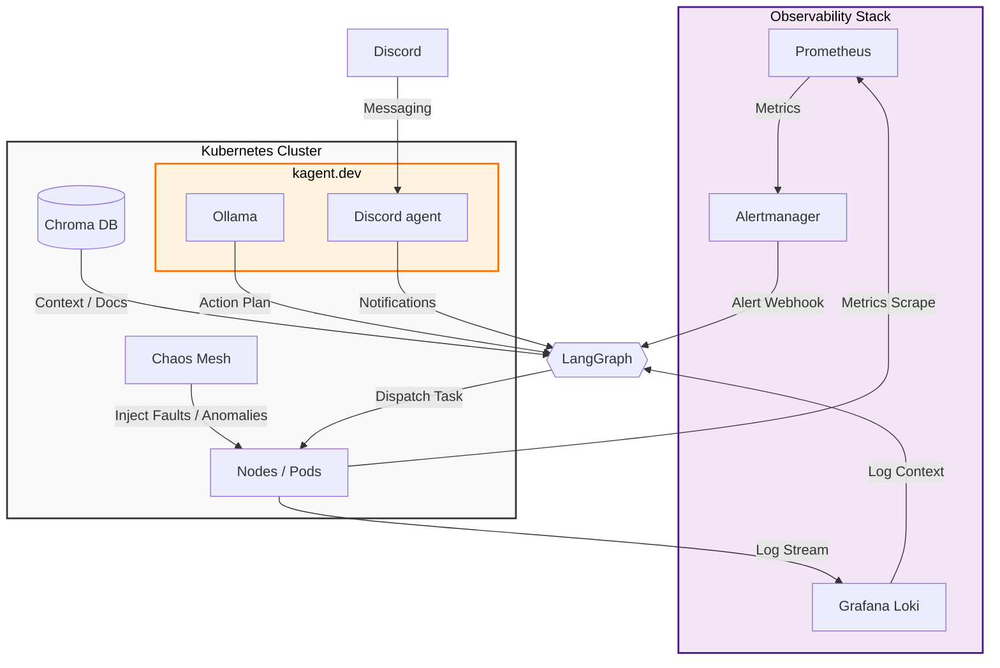

# 🛡️ kRAG: Kinetic Retrieval-Augmented Guardian

#### **Tagline:** The AI-Powered Autonomous Guard for Kubernetes Operations.

---

## 🚀 Overview
**kRAG** is a next-generation autonomous operator designed to transform passive Kubernetes monitoring into an active self-healing ecosystem. By combining the power of **Retrieval-Augmented Generation (RAG)** with agentic reasoning, kRAG acts as a "Digital SRE" that perceives anomalies, reasons through solutions using local intelligence, and executes corrective actions in real-time.

---

## 🛠️ Core Engine
The system architecture is built upon a cutting-edge AI stack:
*   **[kagent.dev](https://kagent.dev/)**: The foundational framework for K8s-native AI agents.
*   **LangGraph**: The orchestration engine for complex, stateful multi-agent reasoning loops.
*   **Local LLM (Ollama)**: Privacy-first, high-performance local inference for log analysis and decision making.
*   **Grafana/Prometheus**: A comprehensive system for gathering and analyzing logs and metrics.

---

## 🏗️ Architecture Diagram

### 🔄 The kRAG Workflow: Step-by-Step

The following points describe the autonomous lifecycle of an incident within the **kRAG** ecosystem:

1.  **Observation & Detection**
    *   **Metrics & Logs Scrape**: Prometheus continuously monitors cluster metrics (CPU, RAM, Disk), while Grafana Loki streams application and system logs.
    *   **Anomaly Trigger**: When a threshold is breached (e.g., *Node Memory Pressure*), Alertmanager sends a **Webhook** directly to the **kRAG Core**.

2.  **Contextual Enrichment**
    *   **Log Retrieval**: Upon receiving an alert, kRAG queries **Loki** to fetch the specific log entries surrounding the event time to understand the "why" behind the "what."

3.  **Intelligence & Knowledge Retrieval (RAG)**
    *   **Experience Lookup**: kRAG sends a search query to the **Vector Database (Chroma)** to see if a similar incident has occurred before and what the successful resolution was.
    *   **Documentation Retrieval**: It pulls relevant runbooks or Kubernetes documentation to provide the LLM with technical constraints.

4.  **Reasoning & Action Planning**
    *   **Prompting the Brain**: The alert, logs, and retrieved documentation are sent to the **Local LLM (Ollama)**.
    *   **Decision Making**: The LLM uses **LangGraph** to reason through the data and output a structured **Action Plan** (e.g., "Delete Pod X" or "Scale Deployment Y").

5.  **Execution & Dispatch**
    *   **Tool Engagement**: The Core dispatches the task to the **Action Toolbox**.
    *   **Kubernetes Intervention**: The toolbox executes the command via the **KubeAPI** (using `kubectl` equivalent commands like patch, restart, or delete).

6.  **Verification & Learning Loop**
    *   **Status Check**: kRAG waits for a predefined period and checks the health of the pods and nodes again.
    *   **Long-term Memory Storage**: If the action was successful, the entire case (Problem + Solution) is indexed back into the **Vector DB**. This ensures kRAG becomes faster and more accurate over time.

7.  **Continuous Improvement (Chaos Testing)**
    *   **Simulated Resilience**: **Chaos Mesh** is used to intentionally inject faults. This forces kRAG to practice its detection and remediation skills in a controlled environment.

## 👥 Authors
* **Janik Szymon**
* **Kluza Łukasz**
* **Sacha Mateusz**

## 📄 License
Copyright © 2024 kRAG Team. All rights reserved.
